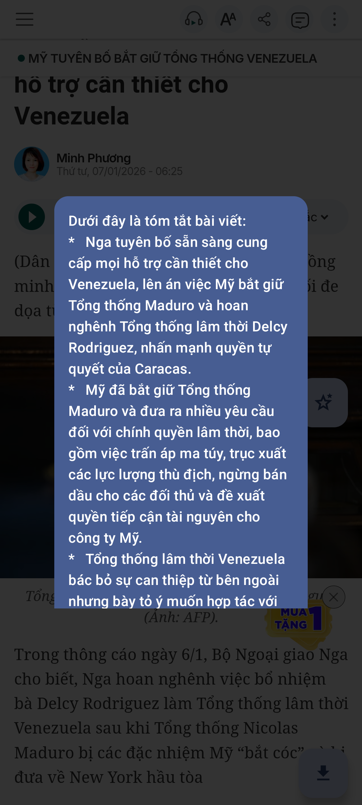
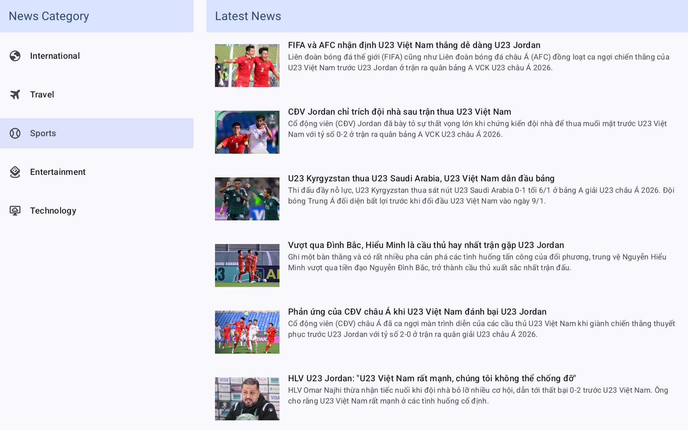
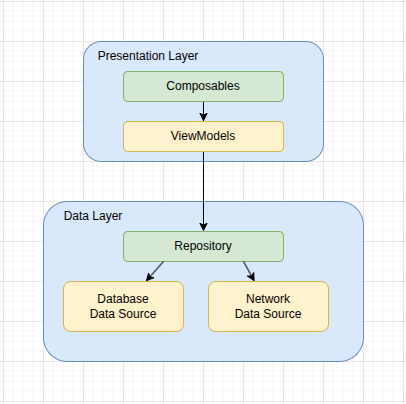

# NewsRead: An Android News Application

## Project Overview
"NewsRead" is an Android application designed to fetch, display, and manage news content. It offers features such as news listing, content display via WebView, media downloads, and AI-powered content summarization. The project emphasizes a modular, multi-module architecture for enhanced maintainability and testability.

## Features

### Core Functionality
*   **News List**: Fetches and displays a list of news articles from a server-less backend.
*   **News Read**: Utilizes Android WebView to render and display full news content.
*   **Media Download**: Detects media files within WebView content and facilitates downloads via the Android `DownloadManager` system service.
*   **Content Summary**: Requests and displays a summarized version of news content from a server-less backend, powered by AI.

### App Captured Preview
          

## Technology Stack

### Android Application
The application leverages a modern Android development stack, promoting robust architecture and reactive programming.
*   **Local Storage**: [Room](https://developer.android.com/jetpack/androidx/releases/room) for persistent local data storage.
*   **Network Request**: [Ktor](https://ktor.io/) for efficient and asynchronous network communication.
*   **Asynchronous Processing**: [Kotlin Coroutines](https://kotlinlang.org/docs/reference/coroutines/basics.html) for simplified asynchronous programming.
*   **UI Implementation**: [Jetpack Compose](https://developer.android.com/jetpack/compose) for declarative UI development, complemented by [Navigation3](https://developer.android.com/guide/navigation/navigation-3) for navigation management.
*   **Dependency Injection**: [Koin](https://insert-koin.io/) for managing and injecting dependencies.
*   **Design System**: [Material 3](https://m3.material.io/) for a modern and consistent user interface.

### Backend Services
The backend functionalities, including news fetching and content summarization, are powered by server-less AWS Lambda functions.
*   **Platform**: [AWS Lambda](https://aws.amazon.com/pm/lambda/) for scalable and cost-effective server-less execution.
*   **HTML Parsing**: [Cheerio](https://cheerio.js.org/) for parsing HTML web pages to extract news content.
*   **Content Summarization**: [GoogleGenAI](https://ai.google.dev/) for AI-driven content summarization.

## Code Architecture
The project adopts a multi-module architecture, designed for clear separation of concerns, improved maintainability, and enhanced testability. While not strictly adhering to a single architectural pattern, it selectively adjusts to match the application's complexity.

**Architecture Diagram**:

### Modules
*   **`data` module**:
    *   **Responsibility**: Manages data sources (network and local storage) and data repositories.
    *   **Functionality**: Handles fetching news data from the network, caching data in a local database, and exposing observable data to its consumers.

*   **`presentation` module**:
    *   **Responsibility**: Contains the UI logic and components.
    *   **Functionality**: Manages displaying the user interface (Activities, Composables) and delegates application logic to the data layer via ViewModels.

*   **`app` module**:
    *   **Responsibility**: The main application module.
    *   **Functionality**: Integrates the `data` and `presentation` modules, sets up dependency injection (Koin), and handles application-level configurations.

## Issues
*   **Data Provider**: The current setup lacks a fully provided backend. I need to implement my own backend services for news fetching and summarization.
*   **Library Version Mismatch**: Resolving dependency conflicts, especially when integrating the latest library versions, is time-consuming. Efforts are made to keep dependencies up-to-date while maintaining compatibility.